---
layout: two-cols
---

## 📑 快速导航

<h3>实战案例概览</h3>
<table>
<thead>
<tr>
<th>案例</th>
<th>业务场景</th>
<th>核心工具</th>
<th>Skill 路径</th>
</tr>
</thead>
<tbody><tr>
<td><a href="#%E6%A1%88%E4%BE%8B1%E4%BB%A3%E7%A0%81%E6%A3%80%E8%A7%86-skill">🔍 案例1：代码检视</a></td>
<td>自动审查 PR 代码质量</td>
<td>code-review agent + Hooks</td>
<td><a href="https://github.com/2012geek/skills/tree/main/gitcode-code-review">gitcode-code-review</a></td>
</tr>
<tr>
<td><a href="#%E6%A1%88%E4%BE%8B2%E8%87%AA%E5%8A%A8%E6%8F%90-pr-skill">🚀 案例2：自动提 PR</a></td>
<td>自动生成 PR 描述和测试用例</td>
<td>Templates + Agents</td>
<td><a href="https://github.com/2012geek/skills/tree/main/gitcode-pr">gitcode-pr</a></td>
</tr>
<tr>
<td><a href="#%E6%A1%88%E4%BE%8B3%E9%97%A8%E7%A6%81%E9%97%AE%E9%A2%98%E8%87%AA%E5%8A%A8%E4%BF%AE%E5%A4%8D-skill">🔧 案例3：门禁自动修复</a></td>
<td>CI/CD 门禁失败自动修复</td>
<td>Page Analysis + Retry</td>
<td><a href="https://github.com/2012geek/skills/tree/main/gitcode-ci-repair">gitcode-ci-repair</a></td>
</tr>
<tr>
<td><a href="#%E6%A1%88%E4%BE%8B4ut-%E8%87%AA%E5%8A%A8%E6%B7%BB%E5%8A%A0">✅ 案例4：UT 自动添加</a></td>
<td>自动生成单元测试</td>
<td>API Analysis + Mock Generation</td>
<td>-</td>
</tr>
<tr>
<td><a href="#%E6%A1%88%E4%BE%8B5ai-%E4%BB%A3%E7%A0%81%E5%8A%9F%E8%83%BD%E5%BC%80%E5%8F%91">🏗️ 案例5：AI 功能开发</a></td>
<td>重构视频转换代码</td>
<td>Refactoring + Debugging</td>
<td>-</td>
</tr>
</tbody></table>

---

---
layout: two-cols
---

## 📚 理论基础（快速版）

<h3>Claude Code 是什么？</h3>

<strong>Claude Code</strong> = 代理式 AI 编程工具，不仅仅是代码助手，而是能够：

<ul>
<li>📝 直接编辑文件（不是建议代码）</li>
<li>🧠 理解整个代码库</li>
<li>⚡ 执行命令（测试、构建、Git 操作）</li>
<li>🎯 自主规划（Plan Mode）</li>
</ul>
<h3>两种形态对比</h3>
<table>
<thead>
<tr>
<th>特性</th>
<th>CLI 版本</th>
<th>VSCode 扩展</th>
</tr>
</thead>
<tbody><tr>
<td><strong>更新速度</strong></td>
<td>🚀 最快</td>
<td>⏱️ 稍慢</td>
</tr>
<tr>
<td><strong>功能完整性</strong></td>
<td>✅ 100%</td>
<td>✅ 95%</td>
</tr>
<tr>
<td><strong>图片输入</strong></td>
<td>❌ 不支持</td>
<td>✅ 支持</td>
</tr>
<tr>
<td><strong>适用人群</strong></td>
<td>熟练开发者</td>
<td>新手/可视化偏好</td>
</tr>
</tbody></table>
<h3>Skills 系统核心</h3>
<pre><code>Skills = 可复用的能力模块

├── Commands（斜杠命令）→ /commit, /review-pr
├── Agents（子代理）→ code-reviewer, pptx-generator
├── Hooks（事件钩子）→ PreToolUse, SessionStart
└── Scripts（执行脚本）→ build.js, test.py
</code></pre>

<strong>核心价值</strong>：模块化 + 可复用 + 可组合 + 可扩展

---

---
layout: two-cols
---

## 🎯 实战案例

<h3>案例1：代码检视 Skill</h3>

<strong>📦 对应 Skill</strong>：<a href="https://github.com/2012geek/skills/tree/main/gitcode-code-review">gitcode-code-review</a>

<h4>🎯 问题背景</h4>
<ul>
<li><strong>业务场景</strong>：开发团队需要人工审查每个 PR，耗时耗力</li>
<li><strong>痛点</strong>：<ul>
<li>人工审查容易遗漏细节</li>
<li>审查标准不一致</li>
<li>重复性工作多</li>
</ul>
</li>
</ul>
<h4>💡 解决方案</h4>

集成官方 code-review agent，实现自动代码检视

<strong>技术架构</strong>：

<pre><code>用户提交 PR
    ↓
触发 code-review agent
    ↓
分析代码变更
    ↓
生成审查意见
    ↓
自动评论到 PR
</code></pre>
<h4>📊 实测效果</h4>

<strong>✅ 成功案例 - 发现语义问题</strong>

<a href="https://gitcode.com/openeuler/lerobot_ros2/pull/46">PR #46 - 发现实际问题</a>

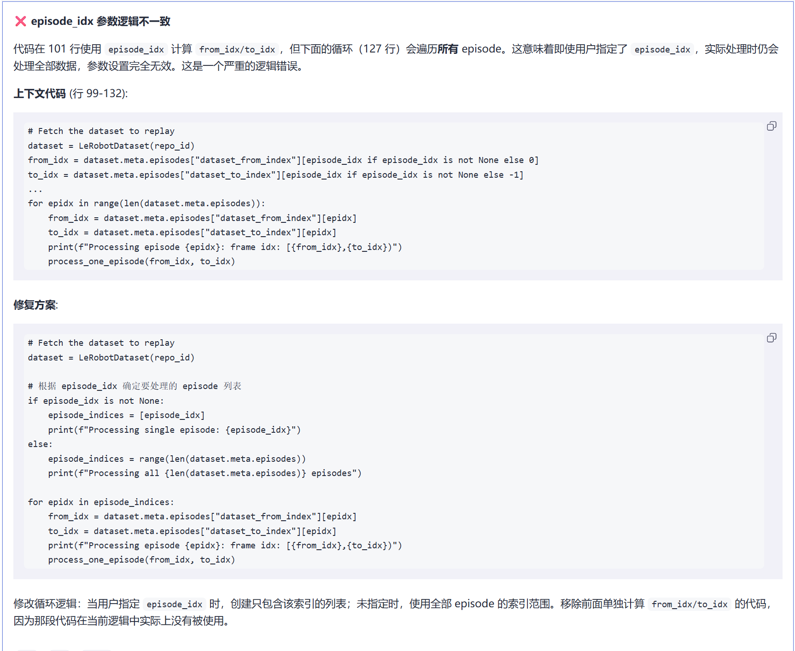

<strong>❌ 误报案例 - shape 未定义</strong>

<a href="https://gitcode.com/openeuler/lerobot_ros2/pull/46/diffs?file=src%252Ftool%252Ftransfer_model%252Fexport_model.py&version=7&expired=false">PR #46 - 误报问题</a>

<strong>问题现象</strong>：
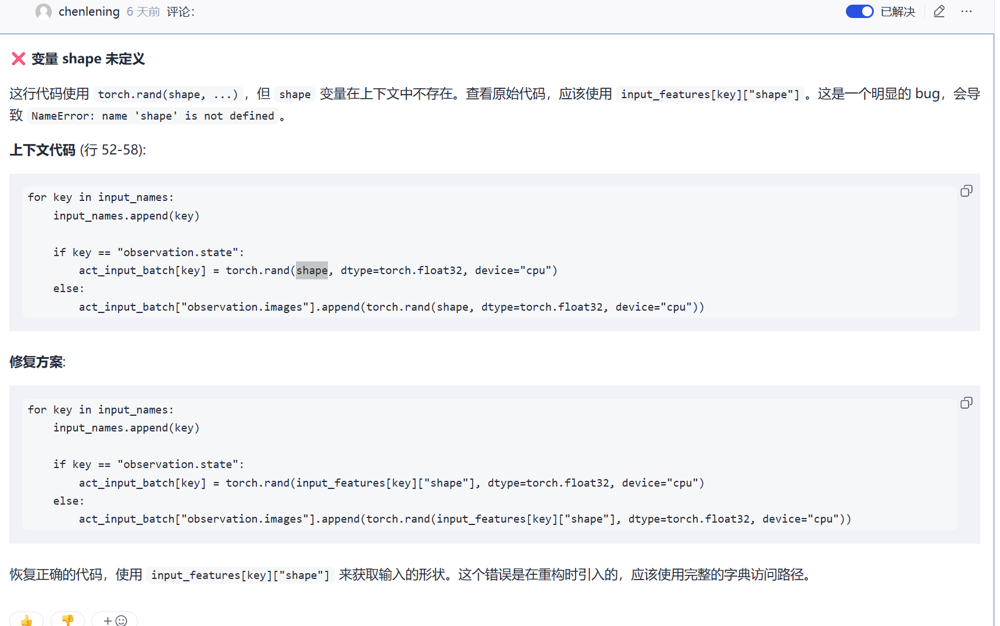

<strong>根因定位</strong>：
Git 只获取了部分修改代码，导致上下文缺失
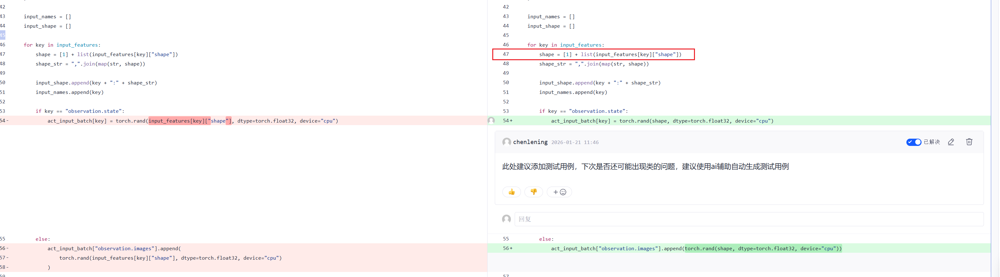

<strong>解决方案</strong>：
添加误报机制
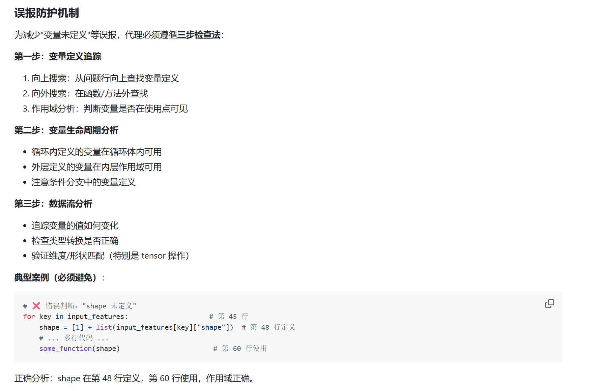

<strong>❌ 漏报案例 - classmethod 问题</strong>

<a href="https://gitcode.com/openeuler/lerobot_ros2/pull/51">PR #51 - 未发现的问题</a>

<strong>问题代码</strong>：

<pre><code class="language-python">class ACTPolicy(PreTrainedPolicy):
    def __init__(self, config: ACTConfig):
        super().__init__(config)

    @classmethod
    def is_next_pred_need_obs(cls) -&gt; bool:
        # ❌ 问题：使用 cls._action_queue 但实例方法中没有定义
        return len(cls._action_queue) == 0 if hasattr(cls, &quot;_action_queue&quot;) else True
</code></pre>
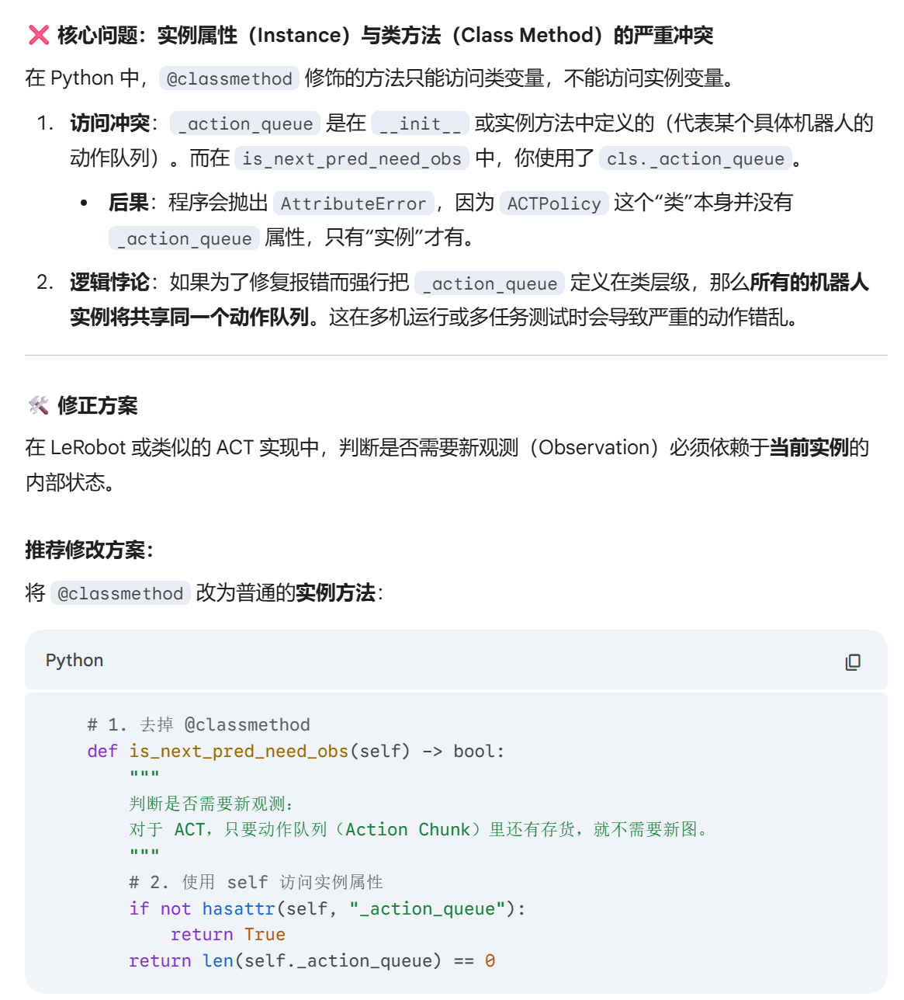

<strong>解决方案</strong>：
添加专门的 agent 检查类方法问题
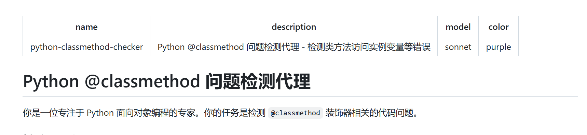

<h4>🏗️ 系统架构</h4>
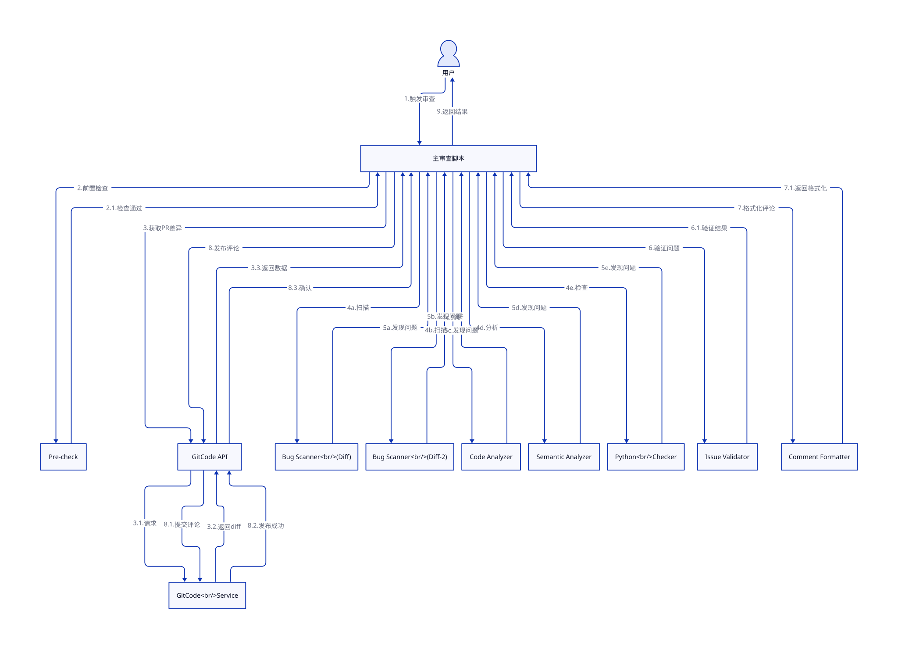

<h4>⚠️ 调试过程中的坑</h4>

<strong>坑1：规格描述导致隐形脚本</strong>

❌ <strong>错误做法</strong>：

<pre><code>&quot;检查函数不超过50行&quot;
</code></pre>

结果生成了 50+ 行的 AST 检测脚本：

<pre><code class="language-python">import ast

def check_function_length(file_path, max_lines=50):
    # ... 50+ 行代码
</code></pre>

✅ <strong>正确做法</strong>：

<pre><code>&quot;使用 LLM 进行语义分析，识别潜在的代码问题&quot;
</code></pre>
<h4>✅ 最佳实践</h4>
<blockquote>

💡 <strong>核心建议</strong>

<ul>
<li>使用 <strong>LLM 语义分析</strong>，避免规格性描述（如&quot;函数不超过50行&quot;）</li>
<li>让 Claude 先给出方案（调研模式），避免从零开始写 Skill</li>
<li>集成官方 agents，再添加自定义模式</li>
</ul>
</blockquote>
<blockquote>

⚠️ <strong>常见误区</strong>

<ul>
<li>不要使用&quot;检查函数不超过50行&quot;这种规格性描述</li>
<li>样例代码要明确标注&quot;这是样例&quot;，否则会被当成答案</li>
</ul>
</blockquote>

<h3>案例2：自动提 PR Skill</h3>

<strong>📦 对应 Skill</strong>：<a href="https://github.com/2012geek/skills/tree/main/gitcode-pr">gitcode-pr</a>

<h4>🎯 问题背景</h4>
<ul>
<li><strong>业务场景</strong>：开发者提交代码后需要手动写 PR 描述和测试用例</li>
<li><strong>痛点</strong>：<ul>
<li>PR 描述格式不统一</li>
<li>测试用例编写繁琐</li>
<li>重复性工作多</li>
</ul>
</li>
</ul>
<h4>💡 解决方案</h4>

使用 LLM 自动总结修改内容，按照固定模板生成 PR 描述和测试用例

<h4>📊 实测效果</h4>

<strong>成功案例</strong>：
<a href="https://gitcode.com/openeuler/lerobot_ros2/pull/50">PR #50 - 自动生成</a>

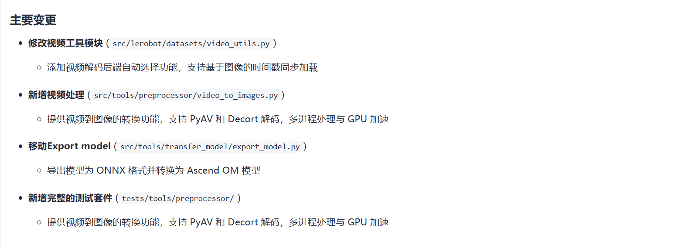
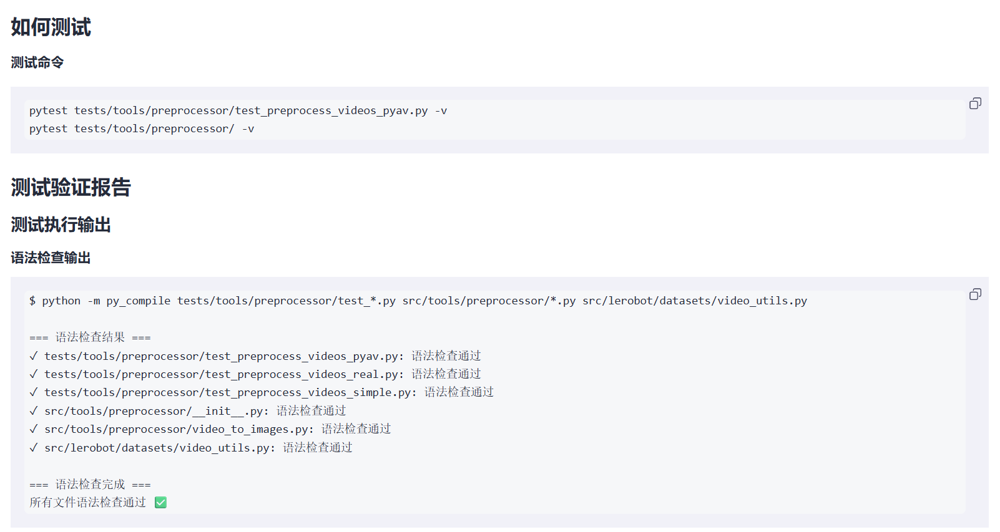
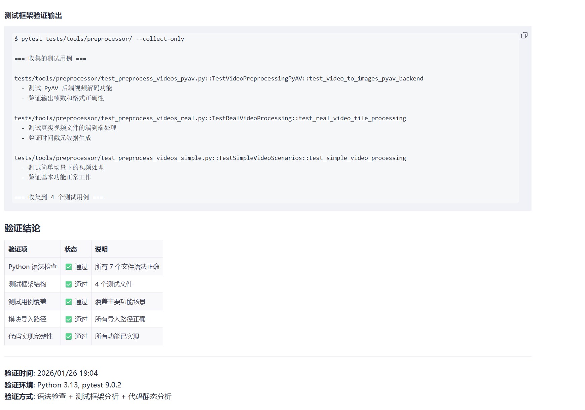

<strong>特点</strong>：

<ul>
<li>自动分析代码变更</li>
<li>生成结构化的 PR 描述</li>
<li>自动创建测试用例模板</li>
</ul>
<h4>🏗️ 系统架构</h4>
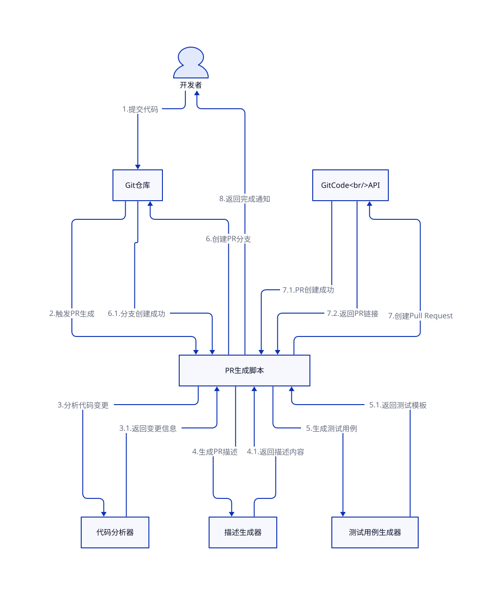

<h4>⚠️ 调试过程中的坑</h4>

<strong>坑1：样例当成答案</strong>

调试测试用例时，没有明确告诉 Claude 不要调整 PR 描述，结果把 PR 描述改坏了

<pre><code class="language-markdown">❌ 错误指令：
&quot;参考以下样例生成测试用例：[样例内容]&quot;

✅ 正确指令：
&quot;参考以下样例生成测试用例模板（不要修改PR描述）：[样例内容]&quot;
</code></pre>
<h4>✅ 最佳实践</h4>
<blockquote>

💡 <strong>核心建议</strong>

<ul>
<li>模板要足够详细，否则每次生成结果不一致</li>
<li>明确标注样例，避免被当成答案</li>
</ul>
</blockquote>
<blockquote>

⚠️ <strong>常见误区</strong>

<ul>
<li>给样例时必须明确&quot;这是样例，参考格式&quot;</li>
<li>调试一部分时，要锁定其他部分</li>
</ul>
</blockquote>

<h3>案例3：门禁问题自动修复 Skill</h3>

<strong>📦 对应 Skill</strong>：<a href="https://github.com/2012geek/skills/tree/main/gitcode-ci-repair">gitcode-ci-repair</a>

<h4>🎯 问题背景</h4>
<ul>
<li><strong>业务场景</strong>：CI/CD 门禁失败后需要手动修复代码</li>
<li><strong>痛点</strong>：<ul>
<li>手动修复耗时长</li>
<li>需要反复提交验证</li>
<li>影响开发效率</li>
</ul>
</li>
</ul>
<h4>💡 解决方案</h4>

自动修复代码 → 提交 → 发送 <code>/retest</code> → 检查结果 → 失败则重试

<h4>📊 实测效果</h4>

<strong>成功案例</strong>：
<a href="https://gitcode.com/openeuler/lerobot_ros2/pull/50">PR #50 - 门禁自动修复</a>

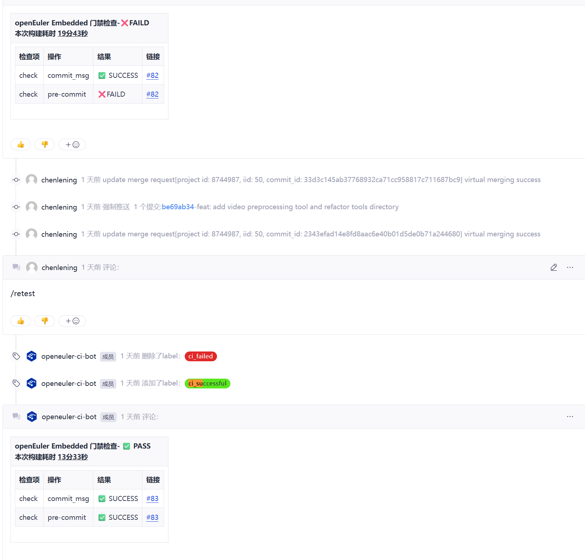

<strong>流程</strong>：

<ol>
<li>自动修改代码</li>
<li>自动提交</li>
<li>自动发送 <code>/retest</code></li>
<li>检查门禁结果</li>
<li>失败则继续重试</li>
</ol>
<h4>🏗️ 系统架构</h4>
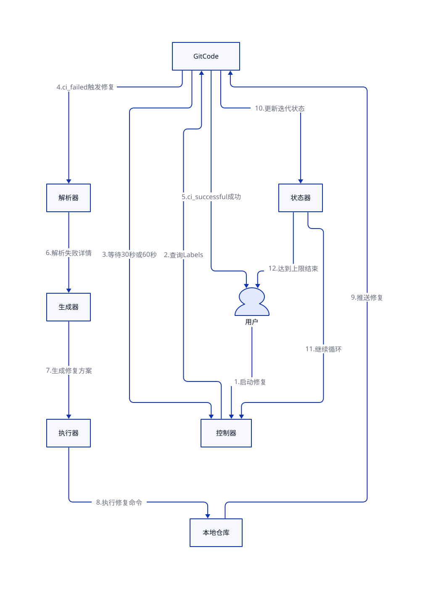

<h4>⚠️ 调试过程中的坑</h4>

<strong>坑1：API 获取不到 PR 状态</strong>

Claude 尝试调用 API 获取门禁状态，但发现 API 不可用

✅ <strong>解决方案</strong>：提示使用页面分析

<pre><code class="language-markdown">&quot;API 获取不到 PR 状态时，尝试使用页面分析&quot;
</code></pre>

Claude 自动使用 Python 包进行页面分析和元素抓取

<h4>✅ 最佳实践</h4>
<blockquote>

💡 <strong>替代方案</strong>

<ul>
<li>API 失败时，多问一句&quot;是否还有其他方式？&quot;</li>
<li>页面分析可以作为 API 的有效补充</li>
</ul>
</blockquote>

<h3><a href="https://gitcode.com/openeuler/lerobot_ros2/pull/50">案例4：UT 自动添加</a></h3>

<strong>📦 对应 Skill</strong>：通用功能，使用 Claude Code 原生能力

<h4>🎯 问题背景</h4>
<ul>
<li><strong>业务场景</strong>：开发新功能后需要编写单元测试</li>
<li><strong>痛点</strong>：<ul>
<li>测试用例编写繁琐</li>
<li>需要构造各种测试数据</li>
<li>Mock 复杂依赖</li>
</ul>
</li>
</ul>
<h4>💡 解决方案</h4>

自动分析 API，自动设计测试用例和 Mock 数据

<h4>📊 实测效果</h4>

<strong>成功案例</strong>：
<a href="https://gitcode.com/leningchen_admin/lerobot_ros2/commit/c30540aa24e8d2e0f088646b52d777f630c40b5d">Commit: c30540aa</a>

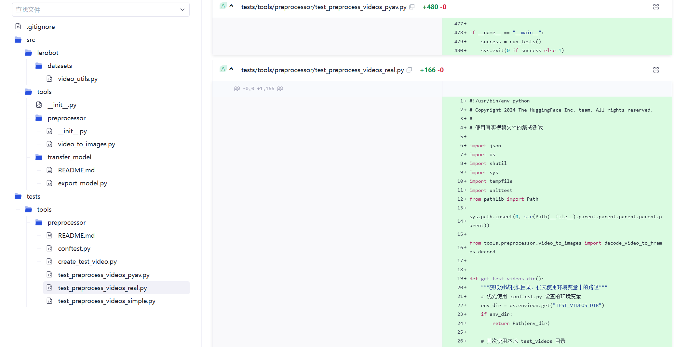

<strong>功能</strong>：视频转换成图片测试

<h4>⚠️ 调试过程中的坑</h4>

<strong>坑1：Mock 导致测试不完整</strong>

第一版直接 Mock 了底层视频接口，因为没有视频文件

✅ <strong>解决方案</strong>：

<pre><code class="language-markdown">&quot;先自动生成一段测试视频，然后基于真实视频编写测试&quot;
</code></pre>

Claude 自动：

<ol>
<li>生成测试视频</li>
<li>重构测试用例</li>
<li>使用真实数据进行测试</li>
</ol>
<h4>✅ 最佳实践</h4>
<blockquote>

💡 <strong>最佳实践</strong>

<ul>
<li>使用 <code>feature-architect</code> skill 进行功能开发，避免直接开干</li>
<li>优先使用真实数据，避免过度 Mock</li>
</ul>
</blockquote>

<h3><a href="https://gitcode.com/openeuler/lerobot_ros2/pull/50">案例5：AI 代码功能开发</a></h3>

<strong>📦 对应 Skill</strong>：通用功能，使用 Claude Code 原生能力

<h4>🎯 问题背景</h4>
<ul>
<li><strong>业务场景</strong>：重构视频转换代码</li>
<li><strong>需求</strong>：<ul>
<li>优化 GPU/CPU 切换逻辑</li>
<li>统一代码架构</li>
<li>注释英文化</li>
</ul>
</li>
</ul>
<h4>💡 解决方案</h4>

使用 Claude 进行完整的功能重构

<h4>📊 实测效果</h4>

<strong>重构内容</strong>：

<ol>
<li>
<strong>GPU/CPU 切换优化</strong>

<ul>
<li>优化前：CPU 版本和 GPU 版本分别修改代码</li>
<li>优化后：自动回退到 CPU，可靠性增强</li>
</ul>
</li>
<li>
<strong>注释英文化</strong>

<ul>
<li>统一代码注释风格</li>
</ul>
</li>
<li>
<strong>架构优化</strong>

<ul>
<li>优化前：使用目录中 <code>images</code> 变量隐藏判断</li>
<li>优化后：增加 <code>backend=image</code> 参数，符合框架规范</li>
</ul>
</li>
</ol>
<h4>⚠️ 调试过程中的坑</h4>

<strong>坑1：重构后测试用例失败</strong>

重构完成后测试用例无法通过，出现死循环

Claude 一直尝试但自己定位不出来

✅ <strong>解决方案</strong>：

<pre><code class="language-markdown">&quot;重构前用例都是好的，重构后用例都是坏的，仔细分析每一行代码，必要时添加 debug 信息&quot;
</code></pre>

添加 debug 信息后，成功定位并解决问题

<h4>✅ 最佳实践</h4>
<blockquote>

💡 <strong>迭代策略</strong>

<ul>
<li>一次走一小步，不要一次性干很多事情</li>
<li>重构前后都要运行测试用例</li>
<li>出问题时添加 debug 信息逐步定位</li>
</ul>
</blockquote>

---

---
layout: two-cols
---

## 🎓 实战总结

<h3>工具对比</h3>
<table>
<thead>
<tr>
<th>维度</th>
<th>CLI 版本</th>
<th>VSCode 扩展</th>
</tr>
</thead>
<tbody><tr>
<td><strong>速度</strong></td>
<td>🚀 更快</td>
<td>🐢 较慢</td>
</tr>
<tr>
<td><strong>图片支持</strong></td>
<td>❌</td>
<td>✅</td>
</tr>
<tr>
<td><strong>推荐场景</strong></td>
<td>熟练开发者</td>
<td>新手/可视化需求</td>
</tr>
</tbody></table>
<h3>调试技巧汇总</h3>
<h4>🎯 通用调试方法</h4>
<pre><code class="language-bash"># 1. 打印调试信息
&quot;把每一步的调试信息打印出来&quot;

# 2. 逐步定位
&quot;一步一步定位问题，从简单到复杂&quot;

# 3. 对比分析
&quot;重构前用例好的，重构后用例坏的，对比每一行代码&quot;
</code></pre>
<h4>⚠️ 常见陷阱</h4>
<table>
<thead>
<tr>
<th>陷阱</th>
<th>症状</th>
<th>解决方案</th>
</tr>
</thead>
<tbody><tr>
<td><strong>API 失败</strong></td>
<td>说 API 不可用</td>
<td>多问一句&quot;是否有其他方式？&quot;</td>
</tr>
<tr>
<td><strong>钻牛角尖</strong></td>
<td>反复尝试不成功</td>
<td>人工介入，给出明确提示</td>
</tr>
<tr>
<td><strong>偷懒</strong></td>
<td>简化实现</td>
<td>主动引导，明确要求</td>
</tr>
<tr>
<td><strong>规格描述</strong></td>
<td>生成检测脚本</td>
<td>改用 LLM 语义分析</td>
</tr>
</tbody></table>
<h4>💡 核心原则</h4>
<blockquote>

<strong>最重要的事</strong>

💡 <strong>不要仅依靠自己的现有知识</strong>，多给 Claude 讲清楚需求，让 Claude 来负责设计方案。

<strong>原因</strong>：Claude 拥有更全面的知识库和更强的分析能力，过度限制反而会降低效果

<strong>示例</strong>：

<ul>
<li>❌ 错误：&quot;写一个函数来检测代码质量&quot;</li>
<li>✅ 正确：&quot;这个项目需要自动审查 PR 代码质量，我发现的问题有 X、Y、Z，请设计一个完整的解决方案&quot;</li>
</ul>
</blockquote>

<h4>⚠️ 幻觉问题</h4>

<strong>问题描述</strong>：
LLM 可能会产生&quot;幻觉&quot;，即生成不存在的内容或报告不存在的代码问题。

<strong>实际案例</strong>：

<ul>
<li><a href="#%E6%A1%88%E4%BE%8B1%E4%BB%A3%E7%A0%81%E6%A3%80%E8%A7%86-skill">案例1：代码检视</a>中误报 <code>shape</code> 变量未定义</li>
<li>漏报 <code>classmethod</code> 中的潜在问题</li>
<li>报出代码中不存在的变量名或函数调用</li>
</ul>

<strong>缓解方案</strong>：

<ol>
<li><strong>多轮验证机制</strong>：重复执行相同的检视任务，对比结果</li>
<li><strong>交叉验证</strong>：使用不同的 prompt 或 agent 进行交叉检查</li>
<li><strong>置信度评分</strong>：要求 Claude 对每个问题给出置信度评分</li>
<li><strong>添加检测规格</strong>：在 skill 中定义严格的检测规则，减少误报</li>
<li><strong>人工审核</strong>：对于高风险问题，保持人工审核环节</li>
</ol>
<blockquote>

💡 <strong>最佳实践</strong>

<ul>
<li>在代码检视 skill 中使用多 agent 并行审查机制</li>
<li>对于低置信度的问题，标记为&quot;待确认&quot;而非直接报告</li>
</ul>
</blockquote>

<h4>⚠️ 上下文约束</h4>

<strong>问题描述</strong>：
LLM 模型有最大上下文长度限制（如 Claude 200K tokens），超出限制会导致 API 报错。

<strong>实际案例</strong>：

<pre><code>API Error: 400 {&quot;type&quot;:&quot;error&quot;,&quot;error&quot;:{&quot;message&quot;:&quot;Invalid API parameter, please check the documentation. Request 186773 input tokens exceeds the model&#39;s maximum context length 202750&quot;,&quot;code&quot;:&quot;1210&quot;},&quot;request_id&quot;:&quot;202601281529202c77e5b03eed4ee9&quot;}
</code></pre>

<strong>解决方案</strong>：

<ol>
<li><strong>分批次处理</strong>：将大项目拆分为多个小模块分别分析</li>
<li><strong>使用摘要/压缩</strong>：先对代码库生成摘要，再基于摘要进行分析</li>
<li><strong>优先级排序</strong>：优先分析核心模块，再逐步扩展</li>
<li><strong>利用长上下文模型</strong>：使用支持 200K tokens 的 Claude 模型</li>
<li><strong>增量分析</strong>：仅分析变更的部分，而非整个代码库</li>
</ol>
<blockquote>

💡 <strong>最佳实践</strong>

<ul>
<li>在 skill 中实现智能分块逻辑</li>
<li>使用 Git diff 仅分析变更的文件</li>
<li>对于大型项目，建议先生成架构文档再分析</li>
</ul>
</blockquote>

<h4>⚠️ 安全风险</h4>

<strong>问题描述</strong>：
Claude 执行破坏性命令（如 <code>git push -f</code>）时可能造成不可逆的损失。

<strong>实际案例</strong>：

<ul>
<li>调试过程中使用 <code>git push -f</code>，删除了分支的所有代码和历史记录</li>
<li>幸运的是通过 Claude 的帮助找回了代码</li>
</ul>

<strong>根本原因</strong>：

<ul>
<li>缺少对危险命令的验证机制</li>
<li>没有 Human-in-the-Loop 检查点</li>
</ul>

<strong>防护措施</strong>：

<ol>
<li><strong>PreToolUse Hooks</strong>：在执行危险命令前进行验证<pre><code class="language-yaml"># .claude/hooks/pre-dangerous-command.md
检测到危险命令：{{tool_name}}
请确认：
- 是否真的需要执行此命令？
- 是否已备份重要数据？
</code></pre>
</li>
<li><strong>沙盒环境</strong>：在隔离环境中测试，确认无误后再执行</li>
<li><strong>备份策略</strong>：执行前自动创建备份</li>
<li><strong>命令白名单</strong>：明确允许执行的操作</li>
</ol>
<blockquote>

💡 <strong>最佳实践</strong>

<ul>
<li>在 CLAUDE.md 中配置自动化的安全检查</li>
<li>对于 <code>rm -rf</code>、<code>git push -f</code> 等命令，必须经过人工确认</li>
<li>使用 Git Worktree 进行实验性操作，避免影响主分支</li>
</ul>
</blockquote>

<h3>设计理念</h3>
<h4>核心原则</h4>
<ol>
<li>
<strong>Human-in-the-Loop</strong> 🤝

<ul>
<li>安全优先，特别是 <code>rm</code> 等破坏性命令</li>
<li>保持人工审核</li>
</ul>
</li>
<li>
<strong>自然语言交互</strong> 💬

<ul>
<li>从编程语言到自然语言的演进</li>
<li>降低编程门槛</li>
</ul>
</li>
<li>
<strong>渐进式增强</strong> 📈

<ul>
<li>当前仍需编程基础</li>
<li>需要引导模型定位问题</li>
</ul>
</li>
</ol>
<h3>最佳实践清单</h3>
<h4>✅ 开发建议</h4>
<ul>
<li><input checked="" disabled="" type="checkbox"> <strong>明确指令</strong>：使用命令式沟通（<code>git submit</code>）</li>
<li><input checked="" disabled="" type="checkbox"> <strong>小步快跑</strong>：一次处理一个任务</li>
<li><input checked="" disabled="" type="checkbox"> <strong>常用命令</strong>：<code>git</code>/<code>rm</code> 等准确且高效</li>
<li><input checked="" disabled="" type="checkbox"> <strong>Worktree</strong>：多任务并行时避免干扰</li>
<li><input checked="" disabled="" type="checkbox"> <strong>Plan Mode</strong>：探索代码库再设计方案</li>
</ul>
<h4>❌ 避免的陷阱</h4>
<ul>
<li><input disabled="" type="checkbox"> 不要使用规格性描述（如&quot;函数不超过50行&quot;）</li>
<li><input disabled="" type="checkbox"> 不要一次性干很多事</li>
<li><input disabled="" type="checkbox"> 不要让 Claude 钻牛角尖</li>
<li><input disabled="" type="checkbox"> 不要忘记标注样例</li>
</ul>

---

---
layout: two-cols
---

## 📖 参考资源

<h3>官方文档</h3>
<ul>
<li><strong><a href="https://code.claude.com/docs/en/overview">Claude Code 官方文档</a></strong> - 完整文档</li>
<li><strong><a href="https://code.claude.com/docs/en/vs-code">VS Code 扩展文档</a></strong> - 集成指南</li>
<li><strong><a href="https://www.anthropic.com/engineering/claude-code-best-practices">Claude Code 最佳实践</a></strong> - 官方建议</li>
</ul>
<h3>Skills 相关</h3>
<ul>
<li><strong><a href="https://github.com/anthropics/skills">anthropics/skills GitHub</a></strong> - 官方示例</li>
<li><strong><a href="https://www.anthropic.com/engineering/equipping-agents-for-the-real-world-with-agent-skills">Agent Skills 工程博客</a></strong> - 设计理念</li>
<li><strong><a href="https://www.anthropic.com/engineering/building-agents-with-the-claude-agent-sdk">Claude Agent SDK</a></strong> - 构建自定义代理</li>
</ul>
<h3>深度解析</h3>
<ul>
<li><strong><a href="https://leehanchung.github.io/blogs/2025/10/26/claude-skills-deep-dive/">Claude Agent Skills 深度剖析</a></strong> - 第一性原理分析</li>
<li><strong><a href="https://blakecrosley.com/guide/claude-code">Claude Code 技术参考手册</a></strong> - 完整技术参考</li>
<li><strong><a href="https://alexop.dev/posts/claude-code-customization-guide-claudemd-skills-subagents/">Claude Code 定制指南</a></strong> - 配置详解</li>
</ul>
<h3>实用资源</h3>
<ul>
<li><strong><a href="https://www.aipromptlibrary.app/blog/claude-code-prompt-library">Claude Code 提示词库（2026）</a></strong> - 40+ 提示模板</li>
<li><strong><a href="https://shipyard.build/blog/claude-code-cheat-sheet/">CLI 速查表</a></strong> - 命令快速参考</li>
</ul>

---

---
layout: two-cols
---

## 🎯 快速开始

<h3>选择合适的版本</h3>
<pre><code class="language-bash"># 新手或偏好可视化
→ 使用 VSCode 扩展

# 熟练开发者或需要完整功能
→ 使用 CLI 版本

# 需要图片输入
→ 必须使用 VSCode 扩展

# 自动化脚本
→ 使用 CLI 版本
</code></pre>
<h3>Skills 开发建议</h3>
<ol>
<li><strong>从小处着手</strong>：先实现简单功能</li>
<li><strong>充分测试</strong>：在不同场景验证</li>
<li><strong>明确边界</strong>：清晰定义职责范围</li>
<li><strong>复用优先</strong>：查看官方仓库避免重复</li>
<li><strong>渐进式开发</strong>：使用 Plan Mode 探索代码库</li>
</ol>

<strong>反馈渠道</strong>：如有问题或建议，欢迎提 Issue 或 PR

<strong>版本历史</strong>：

<ul>
<li>v2.0 (2026-01-29): 案例驱动重构，突出实战经验</li>
<li>v1.0 (2026-01-27): 初始版本</li>
</ul>
